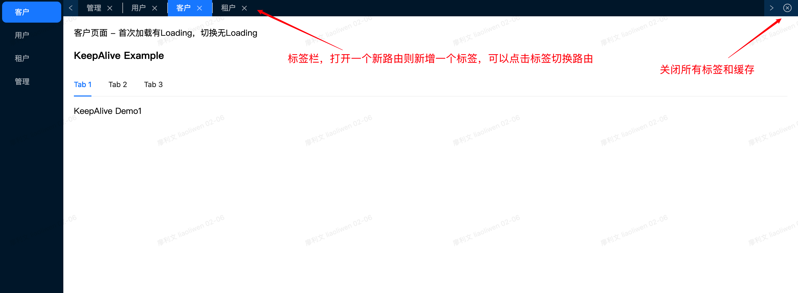

## 安装

```js
// npm
npm i @vgbire/react-keep-alive -S
// pnpm
pnpm i @vgbire/react-keep-alive -S
// yarn
yarn add @vgbire/react-keep-alive
```

## Demo

```js
1. Fork项目（🐶），git clone 到本地
2. pnpm i               //  如果没有需要装一下 pnpm
3. pnpm build           //  打包构建给example项目使用
4. npm run start -w example       // 运行查看示例项目
```

[老的 CodeSandbox 示例项目](https://codesandbox.io/p/sandbox/react-route-cache-demo-nc2xwy)

## KeepAlive

### 基本功能描述

- 实现 KeepAlive 组件缓存
- 实现 useActivated 生命周期函数，会在组件激活时调用，可选择性返回一个 deactivated 函数，改函数会在组件失活时调用。
  > Tip: 如果需要用到 useActivated 生命周期函数，需要使用 KeepAlveScope 包裹 KeepAlive 组件。

```js
import { KeepAliveScope, KeepAlive } from '@vgbire/react-keep-alive';
...
const items = [
  { key: '1', children: <KeepAliveDemo1 /> },
  { key: '2', children: <KeepAliveDemo2 /> },
  { key: '3', children: <KeepAliveDemo3 /> },
];
...
// 需要用到生命周期函数，则加上 KeepAliveScope
// <KeepAliveScope>
<KeepAlive activeKey={activeKey} items={items} />;
// </KeepAliveScope>
```

### KeepAlive 组件属性

```js
activeKey?: string; // 当前激活组件的 Key
include?: string[]; // 只缓存需要缓存的路由组件的 Key
exclude?: string[]; // 排除不需要缓存的路由组件的 Key
max?: number; // 缓存的组件数量，默认 10
items?: Array<{ key: string; children: ReactNode }>; // 缓存的组件列表
styles?：{
  wrapper?: CSSProperties; // 包裹元素的 style
  content?: CSSProperties; // 内容元素的 style
}
```

### KeepAlive 生命周期函数

- useActivated 在组件激活时执行，useActivated 返回的方法会在组件失活时执行。
- 第二个可选参数是一个依赖项数组，为了更新回调函数里的依赖，一般不会用到，功能类似 useCallback，依赖变化不会执行函数。

```js
// KeepAliveDemo1 Code 生命周期函数使用示例
import React, { useEffect } from 'react';
import { useActivated } from '@vgbire/react-keep-alive';

export const KeepAliveDemo1 = () => {
  useEffect(() => {
    console.log('KeepAlive Demo1');
  }, []);
  useActivated(() => {
    console.log('KeepAlive Demo1 激活了');
    return () => {
      console.log('KeepAlive Demo1 失活了');
    };
  });
  return <div>KeepAlive Demo1</div>;
};
```

## 高级功能 - 路由缓存



### 基本功能描述

xw

- 标签式路由页面缓存，打开新路由新增一个标签，切换标签则切换到对应路由
- 缓存路由页面，切换路由或者点击标签切换页面不会重新加载
- Tip: 该功能需要用到react-router-dom V6.0+ API，不支持react-router-dom V5.0及以下版本使用

### 给 Layout 组件的 outlet 加上 keep-alive

```js
// Layout.tsx
import { RouterKeepAlive, RouterTabs, RouterCache } from '@vgbire/react-keep-alive';
import { useOutlet } from 'react-router-dom';

const Layout = () => {
  // 需要使用useOutlet
  const outlet = useOutlet();

  return <RouterKeepAlive bodyStyles={{ wrapper: { padding: 20 } }}>{outlet}</RouterKeepAlive>;
  // 需要自定义时 RouterTabs 和 RouterCache 位置时
  // return (
  //   <RouterKeepAlive custom>
  //     <RouterTabs />
  //     <RouterCache styles={{ wrapper: { padding: 20 } }}>{outlet}</RouterCache>
  //   </RouterKeepAlive>
  // );
};

export default Layout;
```

### 路由定义需要增加 name、cache 属性（cache不配置默认开启缓存）

```js
// router.ts
// 也可以是createHashRouter
import Layout form './Layout'

createBrowserRouter([
    {
        path: "/",
        element: <Layout />,
        loader: rootLoader
        children: [
            {
                path: "events",
                element: <Event />,
                // 增加name属性，否则标签没有title，展示出现问题
                // 如果不需要缓存可以配置cache false, 不配置或者true都会开启缓存
                handle: { name: "事件", cache: false},
            }
         ]
      }
]);
```

### RouterKeepAlive 属性

1. mode

   - path | search，默认为path
   - 默认匹配路由 path 决定，path 变化则会新增一个 tab，也就是如果查询参数变化不会新增一个 tab 缓存组件
   - 如果希望查询参数变化也会新增一个 tab 需要将 mode 改为 search

2. nameKey：如果路由 name 已被占用，可以通过该字段获取 handle 下其他字段的信息作为 tab 的 title
3. cacheMaxRemove

   - boolean，默认false
   - 缓存的 tab 数量超过 max 时，是否删除最开始缓存的 tab。true表示会删除。false会保留tab，但点击tab会重新加载组件

4. theme: 主题颜色，提供 light 和 dark 两种主题色，默认为light
5. size: 大小，提供 large middle 和 small 三种大小，默认为 middle
6. custom: 默认为false，当需要自定义 RouterTabs 和 RouterCache 时，需要将其设置为true
7. bodyStyles: 同 KeepAlive styles属性

```js
interface RouterKeepAliveProps {
  mode?: "path" | "search";
  nameKey?: string;
  cacheMaxRemove?: boolean;
  theme?: 'light' | 'dark';
  size?: 'small' | 'middle' | 'large';
  max?: number;
  custom?: boolean;
  bodyStyles?: {
    wrapper?: CSSProperties;
    content?: CSSProperties;
  };
}
```

### RouterKeepAlive 生命周期函数

useRouterActivated 用法同 [useActivated](#keepalive-生命周期函数)

### RouterKeepAlive 其他 API

- close 方法用于关闭当前标签页
- closeAll 用于关闭除了当前激活的 tab 所有的标签页
- closeNavigator 是为了解决比如表单创建页，创建完之后需要跳转到其他路由。closeNavigator 会关闭当前创建页标签，然后跳转到指定路由。是 close()和 navigator(url)的语法糖。

```js
import { useRouterKeepAliveApi } from '@vgbire/react-keep-alive';
...
  const { close, closeAll, closeNavigator } = useRouterKeepAliveApi();
...
  close()
  closeAll()
  // 是close()和navigator方法跳转到其他路由
  closeNavigator(url)
...
```

### 开发 & 调试

```js
pnpm i
// 构建
npm run build
// 构建后运行example调试
npm run start -w example
// 发布
npm publish
```
